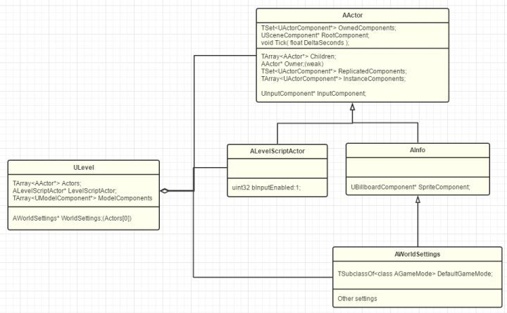

# GamePlay架构（三）WorldContext，GameInstance，Engine
:toc:

## WorldContext
World有很多类型。比如编辑器本身就也是一个World，里面显示的游戏场景也是一个World，这两个World互相协作构成了我们的编辑体验。然后点播放的时候，引擎又可以生成新的类型World来让我们测试。简单来说，UE其实是一个平行宇宙世界观。

```
namespace EWorldType
{
	enum Type
	{
		None,		// An untyped world, in most cases this will be the vestigial worlds of streamed in sub-levels
		Game,		// The game world
		Editor,		// A world being edited in the editor
		PIE,		// A Play In Editor world
		Preview,	// A preview world for an editor tool
		Inactive	// An editor world that was loaded but not currently being edited in the level editor
	};
}
```

而UE用来管理和跟踪这些World的工具就是WorldContext。于独立运行的游戏，WorldContext只有唯一个。而对于编辑器模式，则是一个WorldContext给编辑器，一个WorldContext给PIE（Play In Editor）的World。

## GameInstance
GameInstance里会保存着当前的WorldConext和其他整个游戏的信息。

因为经常有初学者会问到：我的Level切换了，变量数据就丟了，我应该把那些数据放在哪？再清晰直白一点，GameInstance就是你不管Level怎么切换，还是会一直存在的那个对象！

## Engine


此处UEngine分化出了两个子类：UGameEngine和UEditorEngine。

最后实例化出来的UEngine实例用一个全局的GEngine变量来保存。GEngine可以说是一切开始的地方了。

## GamePlayStatics
这个类比较简单，相当于一个C++的静态类，只为蓝图暴露提供了一些静态方法。在想借鉴或者是查询某个功能的实现时，此处往往会是一个入口。

## 总结
从结构上而言，我们已经来到了最根源的地方。GEngine仿佛就是一棵大树的根，当我们拎起它的时候，也会带出整个游戏世界的各个对象。但目前这些对象：Object->Actor+Component->Level->World->WorldContext->GameInstance->Engine，确实已经足够表达UE游戏世界的各个部分。