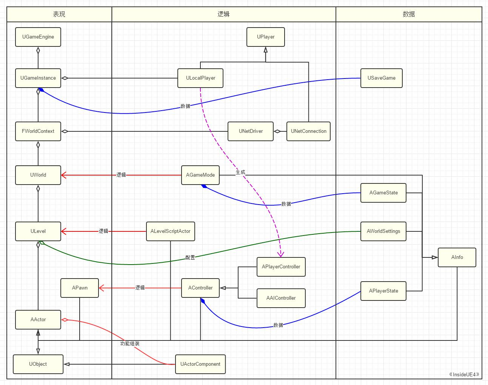

# GamePlay架构（十）总结
:toc:

## 引言
本文作为GamePlay章节的最终章，就是要回顾我们之前探讨过的内容，以一个更高层总览的眼光，把之前的所有内容有机组织起来，思考整体的结构和数据及逻辑的流向。

## 游戏世界
* 在UE的眼里，游戏世界的万物皆Actor，Actor再通过Component组装功能
* 众多的各种Actor子类又组装成了Level
* 一个个的Level，又进一步组装成了World
* 而World之间的切换，UE用了一个WorldContext来保存切换的过程信息
* 而再往上，就是整个游戏唯一的GameInstance，由Engine对象管理着
* GameInstance下不光保存着World，同时也存储着Player，有着LocalPlayer用于表示本地的玩家，也有NetConnection当作远端的连接
* 玩家利用Player对象接入World之后，就可以开始控制Pawn和PlayerController的生成，有了附身的对象和摄像的眼睛。最后在Engine的Tick心跳脉搏驱动下开始一帧帧的逻辑更新和渲染。

## 数据和逻辑
按照MVC的思想，我们可以把整个游戏的GamePlay分为三大部分：表现（View）、逻辑（Controller）、数据（Model）

1. 从UObject派生下来的AActor
2. AActor中一些需要逻辑控制的成员分化出了APawn
3. AController是用来控制APawn的一个特殊的AActor
4. 到了Level这一层，UE为我们提供了ALevelScriptActor（关卡蓝图）当作关卡静态性的逻辑载体
5. 而对于一场游戏或世界的规则，UE提供的AGameMode就只是一个虚拟的逻辑载体
6. World构建好了，该派玩家进来了
7. 所有的表示和逻辑汇集到一起，形成了全局唯一的UGameInstance对象，代表着整个游戏的开始和结束。同时为了方便开发者进行玩家存档，提供了USaveGame进行全局的数据配套

## 整体类图
image:./Image/8.jpg[]

由此也可以看出来，UE基于UObject的机制出发，构建出了纷繁复杂的游戏世界，几乎所有的重要的类都直接或间接的继承于UObject，都能充分利用到UObject的反射等功能，大大加强了整体框架的灵活度和表达能力。比如GamePlay中最常用到根据某个Class配置在运行时创建出特定的对象的行为就是利用了反射功能；而网络里的属性同步也是利用了UObject的网络同步RPC调用；一个Level想保存成uasset文件，或者USaveGame想存档，也都是利用了UObject的序列化；而利用了UObject的CDO（Class Default Object），在保存时候也大大节省了内存；这么多Actor对象能在编辑器里方便的编辑，也得益于UObject的属性编辑器集成；对象互相引用的从属关系有了UObject的垃圾回收之后我们就不用担心会释放问题了。想象一下如果一开始没有设计出UObject，那么这个GamePlay框架肯定是另一番模样了。

## 总结
相信GamePlay也是开发者们日常开发过程中接触最多，也是有可能混淆最多，概念不清，很容易用错的一块主题。在介绍GamePlay的时候，更多的重点是在于介绍各对象的职责和关联，所以更多是用类图来描述结构，反而对源码进行剖析的机会不多，但读者们可以自己去阅读验证。

下个专题：UObject！

有相当部分开发人员，可能不知道也不太关心UObject的内部机制。清楚了UObject，确实对于开发游戏并没有多少直接的提升，但《InsideUE4》系列教程的初衷就是为了深入到引擎内部提高开发者人员的内功。对于有志于想掌握好UE的开发者而言，分析一个游戏引擎，如果只是一直停留在高层的交互，而对于最底层的对象系统不了解的话，那就像云端行走一般，自身感觉飘飘然，但是总免不了内心里有些不安，学习和使用的脚步也会显得虚浮。因此在下个专题，我们将插入UObject的最最深处，把UObject扒得一毛不挂，慢慢领会她的美妙！我们终于有机会得偿心愿，细细把玩一句句源码，了解关于UObject的RTTI、反射、GC、序列化等等的内容。如果你也曾经好奇NewObject里发生了些什么、困惑CreateDefaultSubObject为何只能在构造函数里调用、不解GC是如何把对象给释放掉了、uasset文件里是些什么……