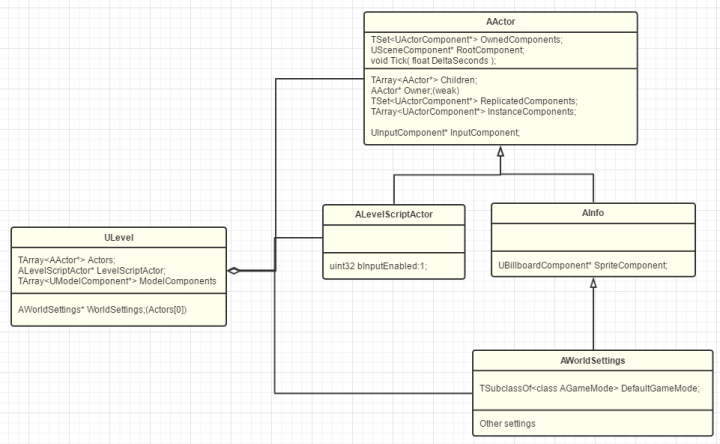

# GamePlay架构（二）Level和World
:toc:

不同的游戏引擎们，看待这个过程的角度和理念也不一样。Cocos2dx会认为游戏世界是由Scene组成的，Scene再由一个个Layer层叠表现，然后再有一个Director来导演整个游戏。Unity觉得世界也是由Scene组成的，然后一个Application来扮演上帝来LoadLevel，后来换成了SceneManager。其他的，有的会称为关卡（Level）或地图（map）等等。而UE中把这种拆分叫做关卡（Level），由一个或多个Level组成一个World。

## Level
ULevel也是继承于UObject，所以支持蓝图，对应关卡蓝图ALevelScriptActor

在此，我也只能进行一番猜测，ALevelScriptActor作为一个特化的Actor,却把Components列表界面给隐藏了，说明UE其实是不希望我们去复杂化关卡构成的。

## World
一个World可以包含多个Level。UE里每个World支持一个PersistentLevel和多个其他Level。Persistent的意思是一开始就加载进World，Streaming是后续动态加载的意思。

orld的Settings也是以PersistentLevel为主的。

World-Level-Actor

## 总结
Level作为Actor的容器，同时也划分了World，一方面支持了Level的动态加载，另一方面也允许了团队的实时协作，大家可以同时并行编辑不同的Level。一般而言，一个玩家从游戏开始到结束，UE会创造一个GameWorld给玩家并一直存在。玩家切换场景或关卡，也只是在这个World中加载释放不同的Level。