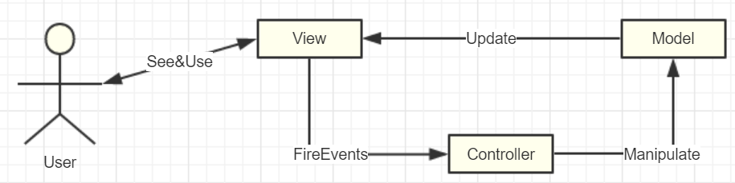

# GamePlay架构（五）Controller
:toc:

## MVC
如果依照纯朴的"程序=数据+算法"的结构来看，再算上用于用户显示和输入的界面，那么就得到“程序=数据+算法+显示”。这三大基本块（数据，算法，显示）构成了程序的三大变化，而如何把这三者“+”到一起，用的就是我们的种种设计框架模式。

典型的，对于游戏：

* “显示”指的是游戏的UI，是屏幕上显示的3D画面，或是手柄上的输入和震动，也可以是VR头盔的镜片和定位，是与玩家直接交互的载体；
* “数据”指的是Mesh，Material，Actor，Level等各种元素组织起来的内存数据表示；
* “算法”可以是各种渲染算法，物理模拟，AI寻路，本文咱们就先暂时特指游戏开发者们编写的游戏业务逻辑。

## AController
察下从AActor继承下来AController怎么样，Actor比Object多了一些我们正需要的配置动态生成、输入事件响应、Tick、可继承、可容纳Component、可在世界里出现、可在网络间同步。好了，现在就差控制Pawn的能力，那我们就在这个分化出来的AController增加一些控制Pawn的接口，这个思路正是和我们从Actor从分化出Pawn的时候不谋而合！

### 思考：Controller和Pawn必须1:1吗？
观察UE实现里我们发现Controller里只是保存了一个Pawn指针，而不是数组。那UE为何不实现成多对多呢？我觉得理由往往很简单，就是想保持一定的简单。当前1:1的时候，我们的脑袋逻辑很清晰，我们可以在Controller里直接GetPawn，也可以在Pawn中GetController，都非常方便。

### 思考：为何Controller不能像Actor层级嵌套？
“控制”本质上来说就是一些代码，不管怎么设计，目的都是用来表达游戏游戏逻辑的。而针对游戏逻辑的复杂，怎么更好的管理组织逻辑代码，我们有状态机，分层状态机，行为树，GOAL（目标导向），甚至你还能搞些神经网络遗传算法机器学习啥的。所以在我们已经有这么多工具的基础上，徒增复杂性是很危险的做法

### 思考：Controller可以显示吗？
读者你可以亲自在PlayController下挂一些Cube之类的Actor，然后在源码层把这两个值改为false，重新编译运行看下结果，看能否正确显示出来。

估计是可以的。

### 思考：Controller的位置有什么意义？
UE还提供了一个bAttachToPawn的开关选项，默认是关闭的，UE不会自动的更新Controller的位置信息；而如果打开，就会把Controller附加到Pawn的子节点里面去，让Controller跟随Pawn来移动。你可以把这两种模式想象成一种是上帝视角在千里之外心电感应控制Pawn，另一种是骑在Pawn肩上来指挥。

如果Controller有自己的位置，这样在Respawn重新生成Pawn的时候，你就可以选择在当前位置创建。

UE甚至还隐藏了Controller的一些更新位置的接口，尽量避免让人手动去操纵。

### 思考：哪些逻辑应该写在Controller中？
* 如果是一些Pawn本身固有的能力逻辑，如前进后退、播放动画、碰撞检测之类的就完全可以在Pawn内实现；而对于一些可替换的逻辑，或者智能决策的，就应该归Controller管辖。

* 从对应上来说，如果一个逻辑只属于某一类Pawn，那么其实你放进Pawn内也挺好。而如果一个逻辑可以应用于多个Pawn，那么放进Controller就可以组合应用了。

* 从存在性来说，Controller的生命期比Pawn要长一些，比如我们经常会实现的游戏中玩家死亡后复活的功能。

## APlayerState
保存玩家状态

## 总结
Component-Actor-Pawn-Controller的结构