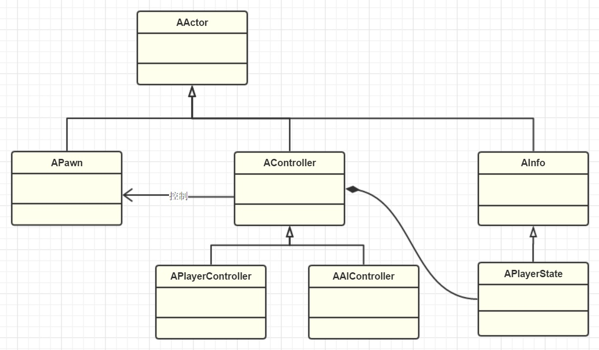

# GamePlay架构（六）PlayerController和AIController
:toc:

## 引言
个游戏里的控制角色大抵都可以分为两类：玩家和AI。

依旧重申：输入、网络、AI行为树等模块虽跟PlayerController和AIController关系紧密，但目前都暂且不讨论，留待各自模块章节再叙述。

## APlayerController
PlayerController因为是直接跟玩家打交道的逻辑类，因此是UE里使用最多的类之一。但是在上述的分析了之后，我们也可以在其中大概归纳出几个模块：

* Camera的管理，目的都是为了控制玩家的视角
* Input系统，包括构建InputStack用来路由输入事件，也包括了自己对输入事件的处理。
* UPlayer关联，既然顾名思义是PlayerController，那自然要和Player对应起来，这也是PlayerController最核心的部分。
* HUD显示，用于在当前控制器的摄像机面前一直显示一些UI
* Level的切换
* Voice，也是为了方便网络中语音聊天的一些控制函数。

简单来说，PlayerController作为玩家直接控制的实体，很多的跟玩家直接相关的操作也都得委托它来完成

[quada]
思考：哪些逻辑应该放在PlayerController中？::
* 如果是按照MVC的视角，那么View对应的是Pawn的表现，而PlayerController对应的是Controller的部分，那Model就是游戏业务逻辑的数据了。
* 记住PlayerController是可被替换的，不同的关卡里也可能是不一样的。
* PlayerController也不一定存在
* 在任一刻，Player:PlayerController:PlayerState是1:1:1的关系。

## AAIController
从某种程度上来说，AI也可以算是一个Player，只不过它不需要接收玩家的控制，可以自行决策行动。从玩家控制的逻辑需要有一个载体一样，AI的逻辑算法也需要有一个运行的实体。而这就是UE里的AIController

同PlayerController对比，少了Camera、Input、UPlayer关联，HUD显示，Voice、Level切换接口，但也增加了一些AI需要的组件：

* Navigation，用于智能根据导航寻路，其中我们常用的MoveTo接口就是做这件事情的。
* AI组件，运行启动行为树，使用黑板数据，探索周围环境，以后如果有别的AI算法方法实现成组件，也应该在本组件内组合启动。
* Task系统，让AI去完成一些任务，也是实现GameplayAbilities系统的一个接口。

[quada]
思考：哪些逻辑应该放在AIController中？::
我们推荐尽量利用UE提供的行为树黑板等组件实现，而不是直接在AIController硬编码再度实现。

## 总结

到此，我们也算讨论完了Actor（Pawn）层次的控制，在这个层次上，我们关注的焦点在于如何更好的控制游戏世界里各种Actor交互和逻辑。UE采用了分化Actor的思维创建出AController来控制APawn们，因为玩家玩游戏也全都是控制着游戏里的一个化身来行动，所以UE抽象总结分化了一个APlayerController来上接Player的输入，下承Pawn的控制。对于那些自治的AI实体，UE给予了同样的尊重，创建出AIController，包含了一些方便的AI组件来实现游戏逻辑。并利用PlayerState来存储状态数据，支持在网络间同步。