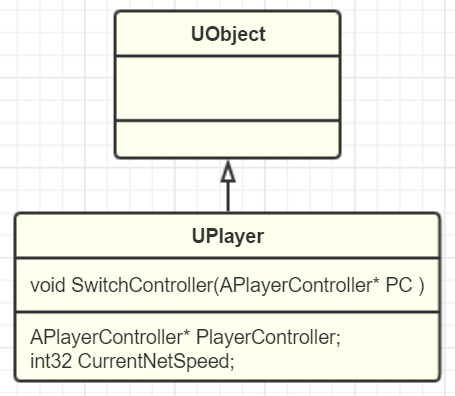

# GamePlay架构（七）GameMode和GameState
:toc:

## 引言
笔者见识过的大部分游戏引擎，解决这个问题的思路就是不解决，要嘛是限制功能，要嘛就是美名其曰让开发者自己灵活控制。

那么什么是玩家呢？狭义的讲，玩家就是真实的你，和你身旁的小伙伴。广义来说，按照图灵测试理论，如果你无法分辨另一方是AI还是人，那他其实就跟玩家毫无区别，所以并不妨碍我们将网络另一端的一条狗当作玩家。那么在游戏引擎看来，玩家就是输入的发起者。游戏说白了，也只是接受输入产生输出的一个程序。所以有多少输入，这些输入归多少组，就有多少个玩家。

## UPlayer
为了利用上UObject的那些现有特性，所以肯定是得从UObject继承了。自然也就需要为每个玩家分配一个PlayerController，所以把PlayerController放在UPlayer基类里是合理的。

## ULocalPlayer
然后是本地玩家，从Player中派生下来LocalPlayer类。对本地环境中，一个本地玩家关联着输入，也一般需要关联着输出（无输出的玩家毕竟还是非常少见）。玩家对象的上层就是引擎了，所以会在GameInstance里保存有LocalPlayer列表。

## UNetConnection
非常耐人寻味的是，在UE里，一个网络连接也是个Player

## 总结
本篇我们抽象出了Player的概念，并依据使用场景派生出了LocalPlayer和NetConnection这两个子类，从此Player就不再是一个虚无缥缈的概念，而是UE里的逻辑实体。UE可以根据生成的Player对象的数量和类型的不同，在此上实现出不同的玩家控制模式，LocalPlayer作为源头Spawn出PlayerController继而PlayerState就是实证之一。而在网络联机时，把一个网络连接看作是一个玩家这个概念，把在World之上的输入实体用Player统一了起来，从而可以实现出灵活的本地远程不同玩家模式策略。