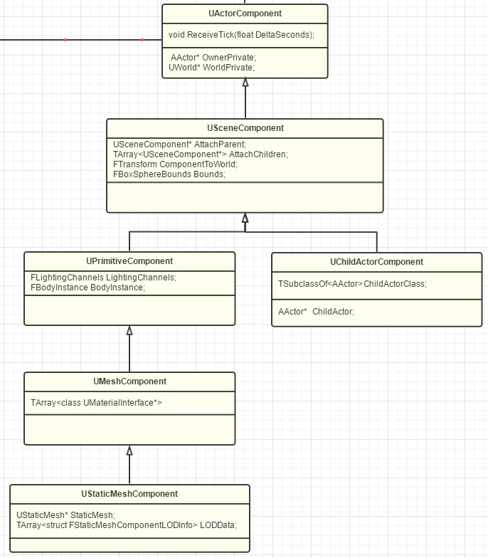

# GamePlay架构（一）Actor和Component
:toc:

## 1. Actor

UObject，UClass，AActor

[qanda]
为何Actor不像GameObject一样自带Transform？::
关键在于，在UE看来，Actor并不只是3D中的“表示”，一些不在世界里展示的“不可见对象”也可以是Actor，如AInfo(派生类AWorldSetting,AGameMode,AGameSession,APlayerState,AGameState等)，AHUD,APlayerCameraManager等，代表了这个世界的某种信息、状态、规则。你可以把这些看作都是一个个默默工作的灵体Actor。

经过了UE的权衡和考虑，把Transform封装进了SceneComponent,当作RootComponent。

## 2. Component

ActorComponent下面最重要的一个Component就非SceneComponent莫属了。SceneComponent提供了两大能力：一是Transform，二是SceneComponent的互相嵌套。

再来说说Component下面的家族（为了阐明概念，只列出了最常见的）：

