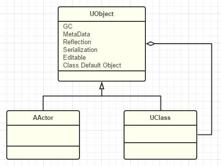

# UObject1_开篇
:toc:

## 引言
藉着UObject提供的元数据、反射生成、GC垃圾回收、序列化、编辑器可见、Class Default Object等，UE可以构建一个Object运行的世界

## 愿景目标
提升内功：
1. 专注于UE的UObject及其周边的系统
2. 本专题的内容对于你使用蓝图实现游戏逻辑几乎“无用”，对正常的表层C++开发也基本上提升不大。本专题只是让你安心一些而已。
3. 本专题为了详细的讨论机制

## 前置知识
1. 优秀的C+\+语言能力，熟练掌握C++11、模板、宏、对象内存模型和基本的各种规则机制
2. 对象反射，需要你对编译原理、元数据、程序结构有一定的了解
3. 对多线程编程比较熟悉，知道并掌握各种线程同步机制。
4. 对C++内存分配管理也比较熟悉，知道一些STL基本的内存分配器，也知道各种内存分配管理的意义和技术，如引用技术，GC等

## 对象模型
为什么需要有一个统一的基类：Object？

大部分的游戏引擎底层都是C+\+，C++是并没有提供原生GC的。我们在编程语言中也常常见到这种模式，比如Java中的object、C#的object，甚至一些纯对象的脚本语言（Ruby里连数字123都是对象）

* Cocos系列，几乎是机械翻译了objective-c的内存管理机制，搞出了一个CCObject，里面只有Retain/Release
* Unity，上层脚本C#是基于Mono的已经实现完善的语言原生管理机制
* 其他引擎，用的还是C++提供了的那些，对象的分配释放也往往需要用户手动管理控制
* Qt里的QObject，Qt里根据QObject基类构建出来的ObjectModel为UI的复杂构建和通信提供了许多了非常便利急需的功能
* UE，UObject，GC和HotReload的黑科技

那么引入一个Object的根基类设计到底有什么深远的影响，我们又付出了什么代价？

得到：

1. 万物可追踪。有了一个统一基类Object，我们就可以根据一个object类型指针追踪到所有的派生对象。
2. 通用的属性和接口。包括但不限于：Equals、Clone、GetHashCode、ToString、GetName、GetMetaData等等。
3. 统一的内存分配释放。
4. 统一的序列化模型。
5. 统计功能。比如说我们想统计看看整个程序跑下来，哪种对象分配了最多次
6. 调试的便利。果你知道它是Object基类下的一个子类对象，你可以把地址转换为一个Object指针，然后就可以一目了然的查看对象属性了。
7. 为反射提供便利。如果没有一个统一Object，你就很难为各种对象实现GetType接口
8. UI编辑的便利。和编辑器集成的时候，为了让UI的属性面板控件能编辑各种对象。不光需要反射功能的支持，还需要引用一个统一Object指针。

代价：

1. 臃肿的Object。我们越想为所有对象提供额外功能，我们就越会在Object里堆积大量的函数接口和成员属性。
2. 不必要的内存负担。有时候有些属性并不是所有对象都用的到
3. 多重继承的限制。改为多重实现接口，避免了数据被继承多份的问题
4. 类型系统的割裂。非是像java和C#那样，对用户隐藏整个背后系统，否则用户在面对原生C++类型和Object类型时，就不得不去思考划分对象类型。

降低和规避代价的方法：

1. 针对太过复杂的Object基类，UE5再改
2. sizeof(UObject)==56，能接受
3. 规避多重继承，UE在BP里提供的也是多重继承Interface的方案
4. 只能多学习了，越是设计精巧的系统就越是难以理解

## 总结
不要觉得引擎只要堆积功能就行了，一开始有个好的结构是重中之重。