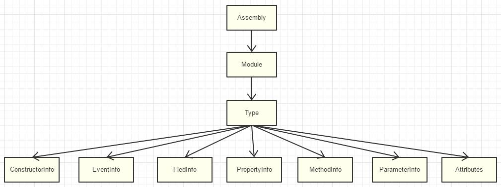

# UObject2_类型系统概述
:toc:

## 引言
Object系统有那么多功能：GC，反射，序列化，编辑器支持……应该从哪一个开始？哪一个是必需的？

反射

## 类型系统
其实“反射”只是在“类型系统”之后实现的附加功能

所以以后更多用“类型系统”这个更精确的术语来表述object之外的类型信息构建，而用“反射”这个术语来描述运行时得到类型的功能，通过类型信息反过来创建对象，读取修改属性，调用方法的功能行为。反射更多是一种行为能力，更偏向动词。类型系统指的是程序运行空间内构建出来的类型信息树组织。

### C# Type
```
Type type = obj.GetType();  //or typeof(MyClass)
```



### C++ RTTI
而谈到C++中的运行时类型系统，我们一般会说RTTI（Run-Time Type Identification），只提供了两个最基本的操作符：

#### typeid
主要作用就是用于让用户知道是什么类型，并提供一些基本对比和name方法

```
const std::type_info& info = typeid(MyClass);

class type_info
{
public:
    type_info(type_info const&) = delete;
    type_info& operator=(type_info const&) = delete;
    size_t hash_code() const throw();
    bool operator==(type_info const& _Other) const throw();
    bool operator!=(type_info const& _Other) const throw();
    bool before(type_info const& _Other) const throw();
    char const* name() const throw();
};
```

#### dynamic_cast
该转换符用于将一个指向派生类的基类指针或引用转换为派生类的指针或引用，使用条件是只能用于含有虚函数的类

```
Base* base=new Derived();
Derived* p=dynamic_cast<Derived>(base);
if(p){...}else{...}
```

## C++当前实现反射的方案
### 宏
手动标记去注册，方法原始书写麻烦，不常使用。

```
struct Test
{
    Declare_Struct(Test);
    Define_Field(1, int, a)
    Define_Field(2, int, b)
    Define_Field(3, int, c)
    Define_Metadata(3)
};
```

### 模板
举一个Github实现比较优雅的C++RTTI反射库做例子：rttr。依然要手动注册

```
#include <rttr/registration>
using namespace rttr;
struct MyStruct { MyStruct() {}; void func(double) {}; int data; };
RTTR_REGISTRATION
{
    registration::class_<MyStruct>("MyStruct")
         .constructor<>()
         .property("data", &MyStruct::data)
         .method("func", &MyStruct::func);
}
```

### 编译器数据分析
用法可以参考：GacUI Demo：PDB Viewer（分析pdb文件并获取C++类声明的详细内容）。比如@vczh的GacUI里就分析了VC编译生成后pdb文件，然后抽取出类型定义的信息实现反射。

但过于依赖平台，分析提取麻烦。

### 工具生成代码
只要分析好C+\+代码文件，或者分析编译器数据也行，然后用预定义好的规则生成相应的C++代码来跟源文件对应上。如Qt里面的反射：

```
#include <QObject>
class MyClass : public QObject
{
    Q_OBJECT
　　Q_PROPERTY(int Member1 READ Member1 WRITE setMember1 )
　　Q_PROPERTY(int Member2 READ Member2 WRITE setMember2 )
　　Q_PROPERTY(QString MEMBER3 READ Member3 WRITE setMember3 )
　　public:
　　    explicit MyClass(QObject *parent = 0);
　　signals:
　　public slots:
　　public:
　　　 Q_INVOKABLE int Member1();
　　　 Q_INVOKABLE int Member2();
　　　 Q_INVOKABLE QString Member3();
　　　 Q_INVOKABLE void setMember1( int mem1 );
　　　 Q_INVOKABLE void setMember2( int mem2 );
　　　 Q_INVOKABLE void setMember3( const QString& mem3 );
　　　 Q_INVOKABLE int func( QString flag );
　　private:
　　　 int m_member1;
　　　 int m_member2;
　　　 QString m_member3;
　};
```

Qt利用基于moc(meta object compiler)实现，用一个元对象编译器在程序编译前，分析C++源文件，识别一些特殊的宏Q_OBJECT、Q_PROPERTY、Q_INVOKABLE……然后生成相应的moc文件，之后再一起全部编译链接。

### UE里HUT的方案
UE当前的方案也是如此，实现在C++源文件中空的宏做标记，然后用UHT分析生成generated.h/.cpp文件，之后再一起编译。

```
UCLASS()
class HELLO_API UMyClass : public UObject
{
	GENERATED_BODY()
public:
	UPROPERTY(BlueprintReadWrite, Category = "Test")
	float Score;

	UFUNCTION(BlueprintCallable, Category = "Test")
	void CallableFuncTest();

	UFUNCTION(BlueprintNativeEvent, Category = "Test")
	void NativeFuncTest();

	UFUNCTION(BlueprintImplementableEvent, Category = "Test")
	void ImplementableFuncTest();
};
```

能够比较小的对C+\+代码做修改，所要做的只是在代码里加一些空标记，并没有破坏原来的类声明结构。缺点是实现起来其实也是挺累人的，完整的C++的语法分析往往是超级复杂的

## 总结
你只是知道了What，How，但是还挡不住别人问一句Why。而功力的提升就在于问一个个why中~