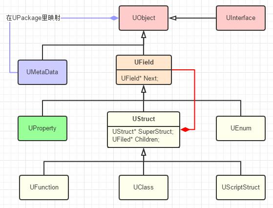

# UObject3_类型系统设定和结构
:toc:

## 引言
两个视角：

1. 一是以一个通用的游戏引擎开发者角度来从零开始设计
2. 二是以当前UE4的现状来考量

## 设定
重点有两点

1. 一是我们可以通过给类、枚举、属性、函数加上特定的宏来标记更多的元数据
2. 二是在有必要的时候这些标记宏甚至也可以安插进生成的代码来合成编译

```
#define UPROPERTY(...)
#define UFUNCTION(...)
#define USTRUCT(...)
#define UMETA(...)
#define UPARAM(...)
#define UENUM(...)
#define UDELEGATE(...)
#define UCLASS(...) BODY_MACRO_COMBINE(CURRENT_FILE_ID,_,__LINE__,_PROLOG)
#define UINTERFACE(...) UCLASS()
```

Q1：为何是生成代码而不是数据文件？ + 
避免了不一致性

Q2：如果标记应该分析哪个文件？ + 
所以UE目前的方案是每个要分析的文件加上该Include并且规定只能当作最后一个include，因为他也担心会有各种宏定义顺序产生的问题。
```
#include "FileName.generated.h"
```

## 结构


* 声明：聚合类型和原子类型
** 聚合类型（UStruct）：
*** UFunction：只可包含属性作为函数的输入输出参数
*** UScriptStruct：只可包含属性，可以理解为C++中的POD struct。“轻量”UObject，不受GC
*** UClass：可包含属性和函数，是我们平常接触到最多的类型
** 原子类型：
*** UEnum：支持普通的枚举和enum class
*** int，FString等基础类型没必要特别声明
* 定义：UProperty，可以理解为用一个类型定义个字段“type instance;”
* 接口：UInterface，只包含函数，可以继承多个接口
* 元数据：UMetaData，其实就是个TMap<FName, FString>的键值对，为Editor提供信息

```
#include "Hello.generated.h"
UENUM()
namespace ESearchCase
{
	enum Type
	{
		CaseSensitive,
		IgnoreCase,
	};
}

UENUM(BlueprintType)
enum class EMyEnum : uint8
{
	MY_Dance 	UMETA(DisplayName = "Dance"),
	MY_Rain 	UMETA(DisplayName = "Rain"),
	MY_Song		UMETA(DisplayName = "Song")
};

USTRUCT()
struct HELLO_API FMyStruct
{
	GENERATED_USTRUCT_BODY()
	
	UPROPERTY(BlueprintReadWrite)
	float Score;
};

UCLASS()
class HELLO_API UMyClass : public UObject
{
	GENERATED_BODY()
public:
	UPROPERTY(BlueprintReadWrite, Category = "Hello")
	float Score;

	UFUNCTION(BlueprintCallable, Category = "Hello")
	void CallableFuncTest();
	
	UFUNCTION(BlueprintCallable, Category = "Hello")
	void OutCallableFuncTest(float& outParam);

	UFUNCTION(BlueprintCallable, Category = "Hello")
	void RefCallableFuncTest(UPARAM(ref) float& refParam);

	UFUNCTION(BlueprintNativeEvent, Category = "Hello")
	void NativeFuncTest();

	UFUNCTION(BlueprintImplementableEvent, Category = "Hello")
	void ImplementableFuncTest();
};

UINTERFACE()
class UMyInterface : public UInterface
{
	GENERATED_UINTERFACE_BODY()
};

class IMyInterface
{
	GENERATED_IINTERFACE_BODY()

	UFUNCTION(BlueprintImplementableEvent)
	void BPFunc() const;

	virtual void SelfFunc() const {}
};
```

Q1：为什么还需要基类UField？ + 
UStruct继承自UField，再继承自UObject

1. 为了统一所有的类型数据
2. 附加UMetaData
3. 方便添加额外的方法

Q2：为什么UField要继承于UObject？ + 
需要序列化

## 总结
可以用但有无伤大雅的含糊之处