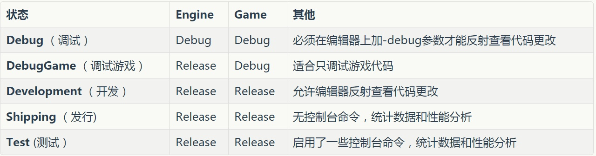
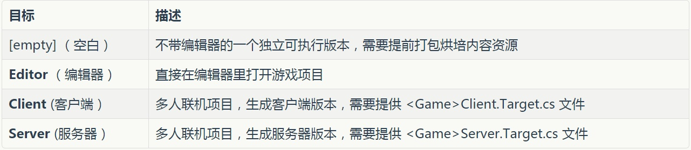
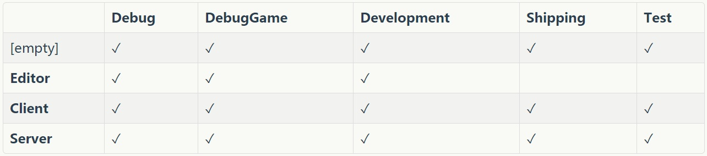

# 基本概念
:toc:

## 1. 项目文件结构
文件目录

* Binaries:存放编译生成的结果二进制文件。该目录可以gitignore,反正每次都会生成。
* Config:配置文件。
* Content:平常最常用到，所有的资源和蓝图等都放在该目录里。
* DerivedDataCache：“DDC”，存储着引擎针对平台特化后的资源版本。比如同一个图片，针对不同的平台有不同的适合格式，这个时候就可以在不动原始的uasset的基础上，比较轻易的再生成不同格式资源版本。gitignore。
* Intermediate：中间文件（gitignore），存放着一些临时生成的文件。有：
** Build的中间文件，.obj和预编译头等
** UHT预处理生成的.generated.h/.cpp文件
** VS.vcxproj项目文件，可通过.uproject文件生成编译生成的Shader文件。
** AssetRegistryCache：Asset Registry系统的缓存文件，Asset Registry可以简单理解为一个索引了所有uasset资源头信息的注册表。CachedAssetRegistry.bin文件也是如此。
* Saved：存储自动保存文件，其他配置文件，日志文件，引擎崩溃日志，硬件信息，烘培信息数据等。gitignore
* Source：代码文件。

## 2. 编译类型
每种编译配置包含两种关键字。第一种表明了引擎以及游戏项目的状态。第二个关键字表明正在编译的目标。

所以为了我们的调试代码方便，我们选择 *DebugEditor* 来加载游戏项目，当需要最简化流程的时候用 *Debug* 来运行独立版本。

## 3. 命名约定
下面是一些基本需要知道的：
* 模版类以T作为前缀，比如TArray,TMap,TSet UObject派生类都以U前缀
* AActor派生类都以A前缀
* SWidget派生类都以S前缀
* 抽象接口以I前缀
* 枚举以E开头
* bool变量以b前缀，如bPendingDestruction
* 其他的大部分以F开头，如FString,FName
* typedef的以原型名前缀为准，如typedef TArray FArrayOfMyTypes;
* 在编辑器里和C#里，类型名是去掉前缀过的
* UHT在工作的时候需要你提供正确的前缀，所以虽然说是约定，但你也得必须遵守。（编译系统怎么用到那些前缀，后续再讨论）

## 4. 基础概念
和其他的3D引擎一样，UE4也有其特有的描述游戏世界的概念。在UE4中，几乎所有的对象都继承于UObject（跟Java,C#一样），UObject为它们提供了基础的垃圾回收，反射，元数据，序列化等，相应的，就有各种"UClass"的派生们定义了属性和行为的数据。

## 5. 编译系统
* UnrealBuildTool（UBT，C#）：UE4的自定义工具，来编译UE4的逐个模块并处理依赖等。我们编写的Target.cs，Build.cs都是为这个工具服务的。
* UnrealHeaderTool （UHT，C加加）：UE4的C加加代码解析生成工具，我们在代码里写的那些宏UCLASS等和#include "*.generated.h"都为UHT提供了信息来生成相应的C加加反射代码。

一般来说，UBT会先调用UHT会先负责解析一遍C++代码，生成相应其他代码。然后开始调用平台特定的编译工具(VisualStudio,LLVM)来编译各个模块。最后启动Editor或者是Game.

## 999. 参考资料
* UE4代码规范 https://docs.unrealengine.com/zh-CN/Programming/Development/CodingStandard/index.html